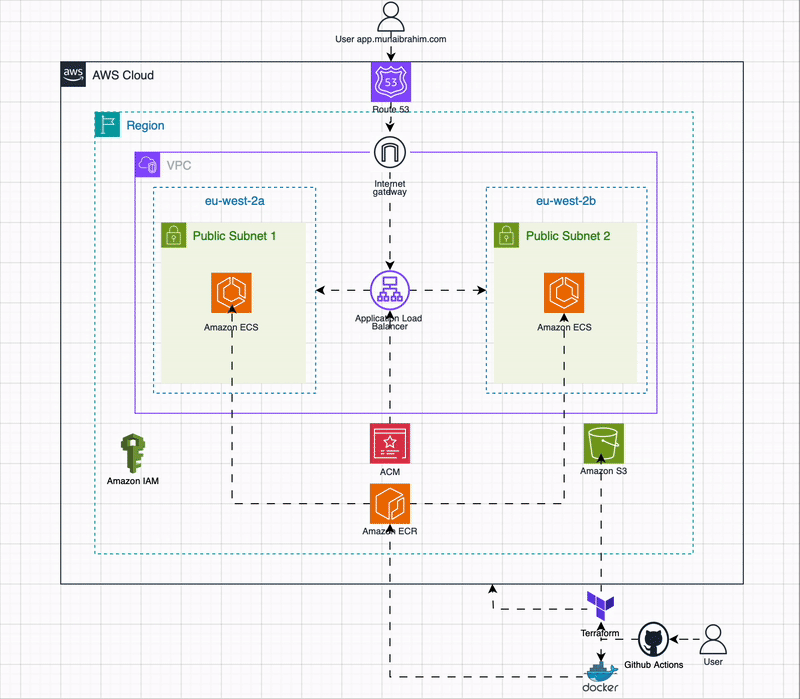
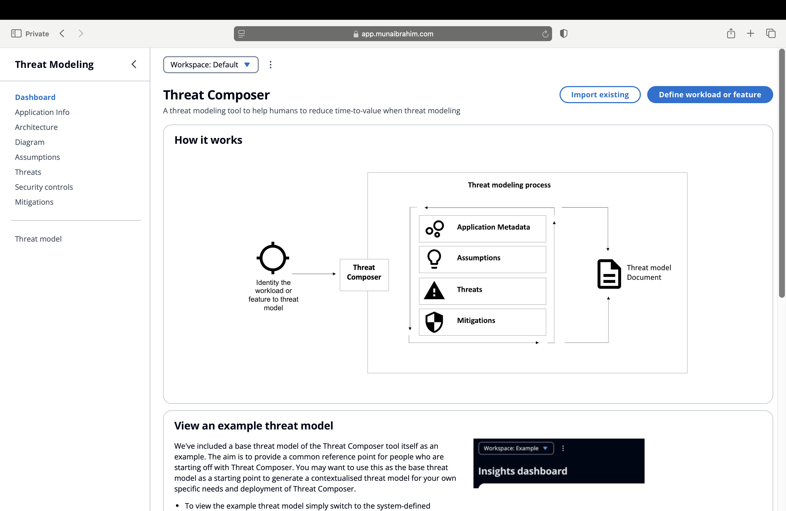
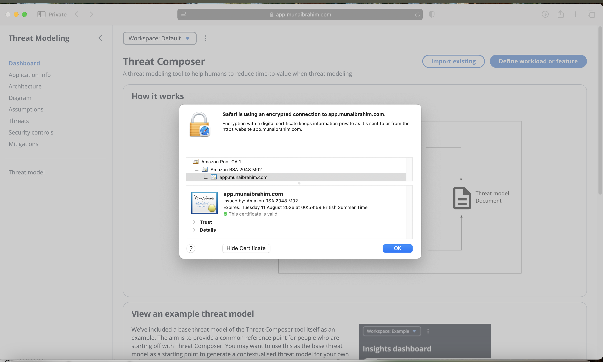
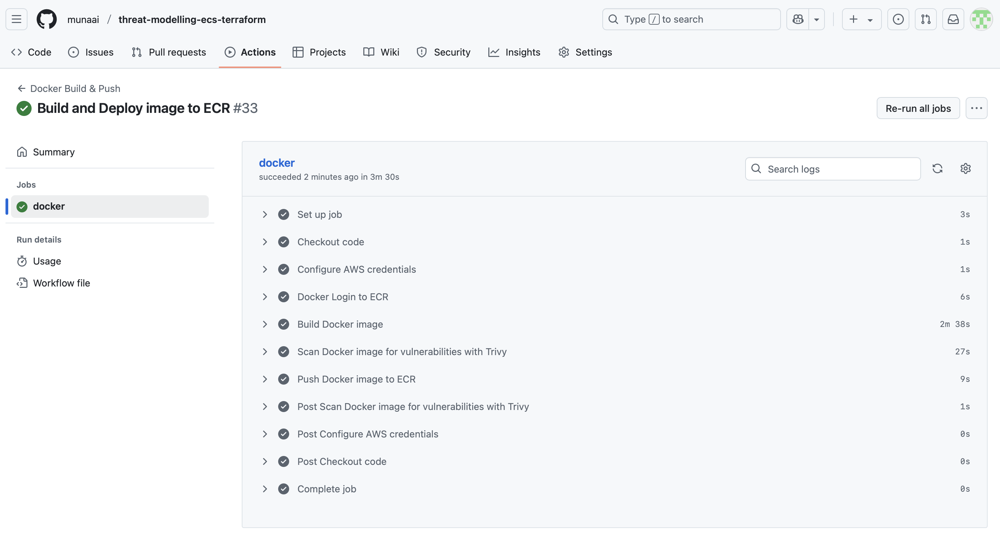
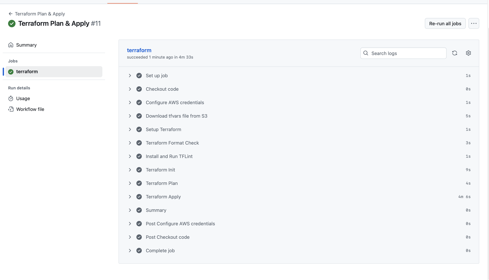
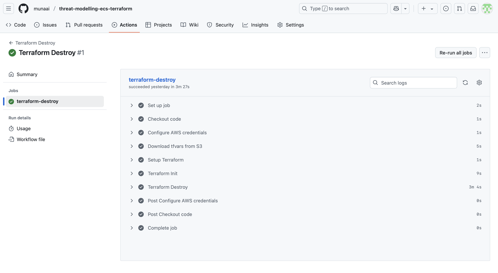

# Containerised Threat Modelling Tool on AWS ECS Fargate

This project deploys a containerised application to **AWS ECS Fargate** using **Terraform**, with end-to-end automation via **GitHub Actions**.

This setup was created to **automate the deployment** of a threat modelling tool while avoiding the need to **manually provision resources** through the AWS Console. By using **Terraform** and **GitHub Actions**, the entire infrastructure and deployment process becomes **repeatable, consistent, and much faster** — reducing **human error** and saving time across development and operations.

##  Architecture diagram

  

## Features

- Fully automated infrastructure using Terraform
- Docker container pushed to Amazon ECR
- ECS Fargate service behind an ALB with HTTPS
- SSL certificate issued via ACM and validated through Route 53
- GitHub Actions workflows for:
- Docker image build & push
- Terraform plan, apply, and destroy

## Project Structure
<pre>
./
├── app/
├── Dockerfile
├── terraform/
│   ├── main.tf
│   ├── provider.tf
│   ├── variables.tf
│   └── modules/
│       ├── acm/
│       ├── alb/
│       ├── ecs_fargate/
│       ├── iam/
│       ├── route53/
│       ├── security_groups/
│       └── vpc/
└── .github/
    └── workflows/
        ├── apply.yml
        ├── destroy.yml
        ├── docker.yml
        └── plan.yml

</pre>

## Local App Setup 💻
### Option 1: Run Locally Without Docker
<pre>
yarn install
yarn build
yarn global add serve
serve -s build
</pre>
Then visit: http://localhost:3000

### Option 2: Run Using Docker
<pre>
docker build -t my-app .
docker run -p 3000:3000 my-app
</pre>
Then visit: http://localhost:3000

## Deployment Workflow
### Docker Build and Push
- Builds the Docker image
- Performs a security scan using Trivy
- Pushes the image to Amazon ECR

### Terraform Plan and Apply
- Runs after a successful Docker build or when manually triggered.
- Sets up AWS credentials and downloads terraform.tfvars from S3.
- Runs Terraform formatting check, linter, plan, and apply.
- Automatically provisions or updates infrastructure on AWS.

### Terraform Destroy
- Destroys all infrastructure managed by Terraform when no longer required

## Here is a demonstration
### Domain page

  

### SSL certificate

  

### Docker Build and Push to ECR

  

### Terraform Deploy

  

### Teraform Destroy

  

